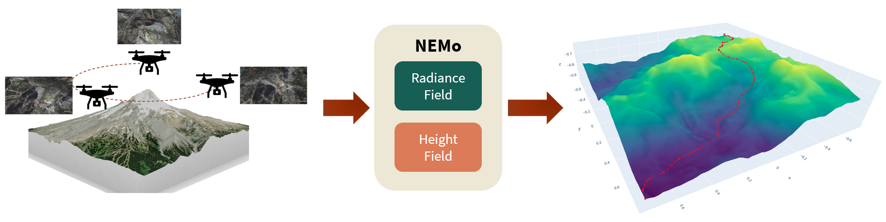

# Neural Elevation Models (NEMo) for Terrain Mapping and Planning

Code for Neural Elevation Models (NEMo), and framework for terrain mapping and path planning. 
This repo contains code for loading trained NEMos and performing path planning on them.
The code for NEMo training can be found at: https://github.com/Stanford-NavLab/nerfstudio/tree/adam/terrain

<br>
<p align="center">

</p>

## Setup

Clone the GitHub repository:

    git clone https://github.com/adamdai/neural_elevation_models.git

Create and activate conda environment:

    conda create -n nemo python=3.8   
    conda activate nemo
    
Install dependencies:

    cd neural_elevation_models
    pip install -r requirements.txt
    pip install -e .

Install pytorch and cuda-toolkit:

    pip install torch==2.1.2+cu118 torchvision==0.16.2+cu118 --extra-index-url https://download.pytorch.org/whl/cu118
    conda install -c "nvidia/label/cuda-11.8.0" cuda-toolkit

Install tiny-cuda-nn:

    pip install ninja git+https://github.com/NVlabs/tiny-cuda-nn/#subdirectory=bindings/torch

Install GDAL (for working with `.tif` DEMs):

    conda install -c conda-forge gdal

(Developed and tested with Ubuntu 20.04/22.04 and Windows 10)

## Data

Download the data folder from [this link](https://drive.google.com/drive/folders/1SYb95B8LTitj2U5j3_VF_ZMr46UKhYDT?usp=sharing) and place it in the repo.
```
data/
|-- lunar/
|-- kt22/
|   |-- colmap_points3D.txt
|-- redrocks/
|   |-- DEM32-DroneMapper.tif
|   |-- colmap_points3D.txt
```
These files are used for DEM comparison to COLMAP and ground truth.

## Models

Weights of trained height networks for the KT-22 and Red Rocks scenes can be found under the `models` folder. 


## Path Planning

The notebook `height_net.ipynb` loads a trained NEMo (KT-22 or Red Rocks), and performs path planning via A* initialization then continuous path optimization.
